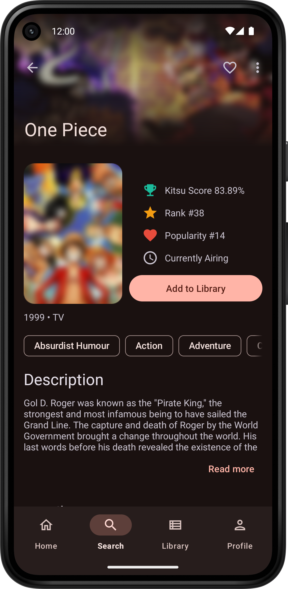

<h1>Kitsune</h1>

Unofficial android app for [Kitsu.app](https://kitsu.app) (Kitsu.io). Discover new Anime and Manga and manage your Library.

## Features
- Explore and search Anime and Manga, even without an account
- View Anime and Manga details including Episodes/Chapters and Characters
- Manage your Kitsu Library and account settings
- Cached Library for offline use
- Multiple dark and light app themes
- Material 3 Design
- Home screen widget

#### Missing features
- Reactions/Comments
- Global message feed and announcements
- Groups
- Search for other users

## Download
> Requires Android 8.0 or higher.

Kitsune is available for download on GitHub and F-Droid.

[Download latest app release on GitHub.](https://github.com/Drumber/Kitsune/releases/latest)

## Bug reports, Feature requests and Contribution
> Please be aware of the [Code of Conduct](CODE_OF_CONDUCT.md) in place.

Report a bug or request a new feature

  - Please check out [existing issues](https://github.com/Drumber/Kitsune/issues?q=is%3Aissue) first to avoid duplicates.
  - [Open a new issue](https://github.com/Drumber/Kitsune/issues/new/choose)

Contribute to Kitsune

  - See [Contributing](CONTRIBUTING.md) for more details.

### Localization
Are you interested in translating Kitsune into your language?  
Head over to the Kitsune project on [Hosted Weblate](https://hosted.weblate.org/engage/kitsune/) and help localize the app.

## Screenshots
  

 
