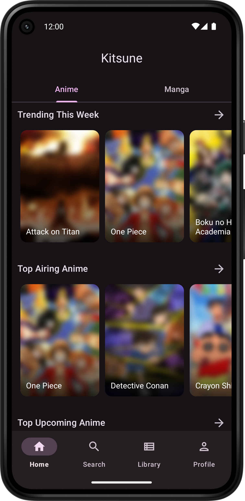
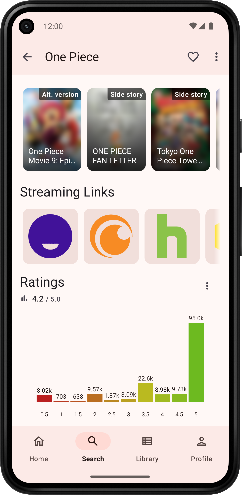

<h1>Kitsune</h1>

Unofficial android app for [Kitsu.io](https://kitsu.io). Discover new Anime and Manga and manage your Library.

## Features
- Explore and search Anime and Manga, even without an account
- View Anime and Manga details including Episodes/Chapters and Characters
- Manage your Kitsu Library and account settings
- Cached Library for offline use
- Light, Purple and Dark app theme
- Material 3 Design

#### Not yet implemented
- Reactions/Comments
- Global message feed and announcements
- Groups
- Search for other users

## Download
[Download latest app release on GitHub.](https://github.com/Drumber/Kitsune/releases/latest)
> Requires Android 8.0 or higher.

## Screenshots
  

 
