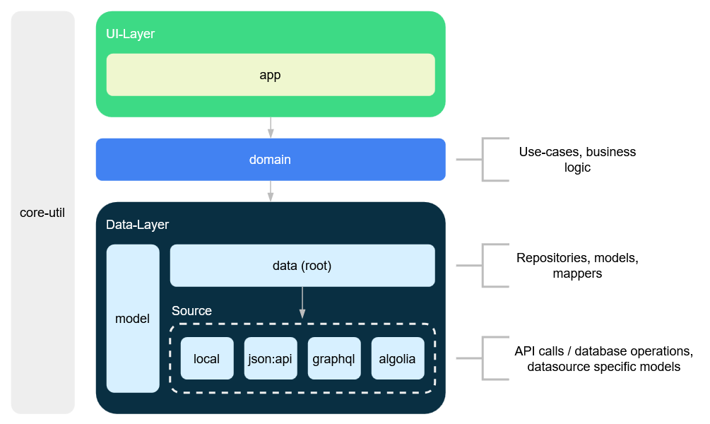

# Project Architecture & Structure

The app architecture is oriented towards Google's best practice recommendations for building android apps (see [Guide to app architecture](https://developer.android.com/topic/architecture)).

## Project Structure

The project consists of multiple layers. The layers are:

```
0. ui
1. domain
2. data
```

Dependencies between layers are **unidirectional**, meaning that a layer can only depend on the layers below it.

The dependencies are as follows: `ui -> domain -> data`

Additionally, common code that is shared between layers is placed in the `core-util` module.


### 0. UI Layer

The UI layer contains code that is responsible for running the application, displaying the user interface and handling user interactions.

The UI layer consists of the following module:

- `app` - Contains the main application code and the home screen widget.


### 1. Domain Layer

The domain layer contains use cases and reusable business logic for interacting with the data layer.


### 2. Data Layer

The data layer contains the data models and data sources and is responsible for fetching and storing data.

The data layer is divided into the following packages:

```
- mapper
- repository
- source
  - local
  - JSON:API
  - GraphQL
  - Algolia search
```

The data model also contains the `model` module which contains the domain models.
The separate `model` module prevents domain models to depend on any data source.

### Diagram (outdated)


